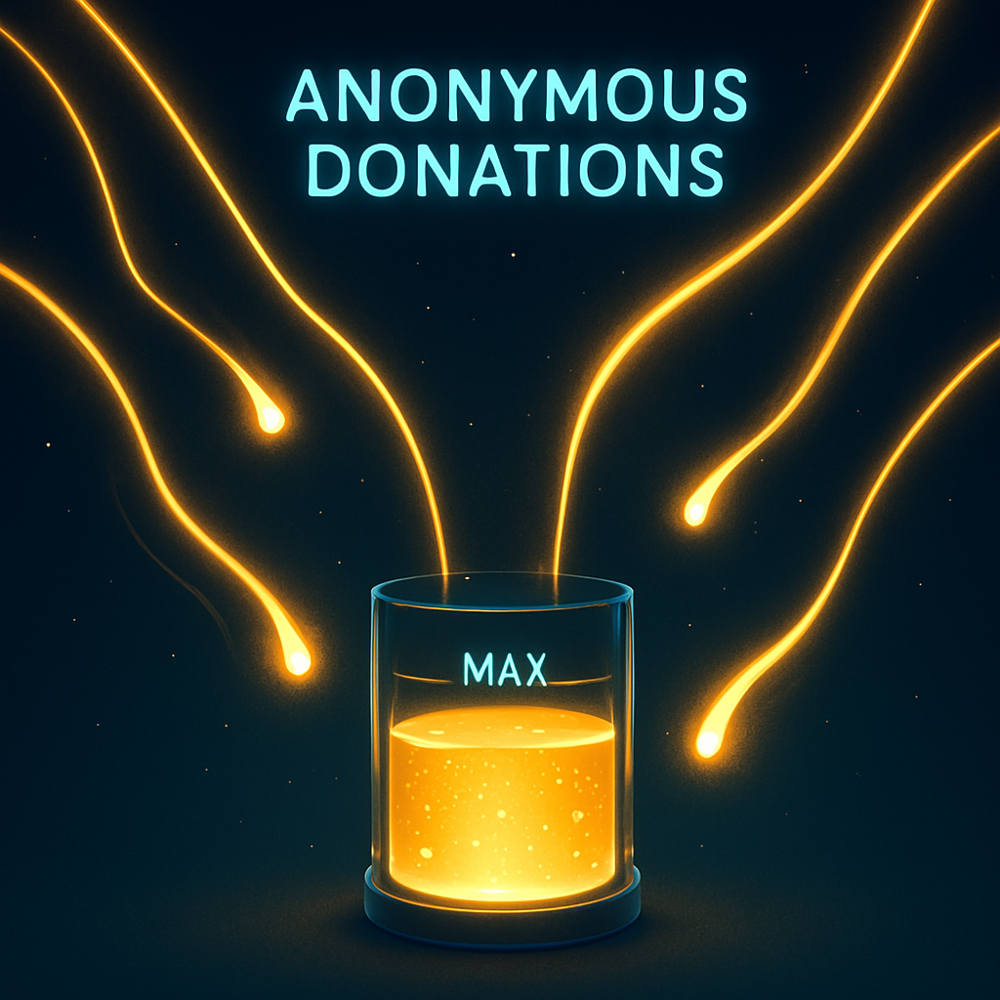

# Crowdera: Anonymous Funding Event Platform



> **A transparent donation platform that prevents over-funding of causes by enforcing funding caps with commemorative NFT badges on Zircuit and Flow.**

## Table of Contents

- [Overview](#overview)
- [Integration](#integration)
- [Team](#team)
- [Setup](#setup)
- [Experience & Feedback](#experience--feedback)
- [Demo](#demo)
- [Future Roadmap](#future-roadmap)
- [Repository Structure](#repository-structure)

## Overview

Crowdera addresses a critical issue in Thailand's donation landscape. We've all seen dramatic stories of people in need that flood social media feeds, generating overwhelming donation responses that often exceed actual needs. This can transform genuine assistance into problematic wealth accumulation for recipients.

Our platform enables transparent event and cause funding with clearly defined goals. By setting funding caps and automatically enforcing them, we ensure donations match actual needs without excess. The system provides real-time updates on campaign progress and stops accepting donations once goals are met, preventing the problem of over-donation while rewarding donors with commemorative NFTs.

## Integration

### Zircuit Integration

We integrated Zircuit to implement our secure donation platform:

- Used Zircuit for the primary smart contract deployment where campaign creation and donations occur
- Created smart contract logic that automatically stops accepting donations once a campaign's funding goal is reached
- Leveraged Zircuit's blockchain for seamless wallet interactions, providing a smooth user experience
- Mints NFT badges for successful donations
- Integrated a refund mechanism for cases where funds need to be returned

### Flow Integration

We utilized the Flow blockchain to create and distribute commemorative NFT badges to donors:

- Used Flow for the primary smart contract deployment where campaign creation and donations occur
- Not support EIP7702 so the user need to batch transaction and send it to the CampaignManager directly 
- Created smart contract logic that automatically stops accepting donations once a campaign's funding goal is reached
- Leveraged Zircuit's blockchain for seamless wallet interactions, providing a smooth user experience
- Mints NFT badges for successful donations
- Integrated a refund mechanism for cases where funds need to be returned

Our donation works as follows:
1. User selects a campaign and donation amount
2. System processes the donation
3. Smart contract accepts the donation and updates the campaign status
4. If the donation would exceed the campaign's goal, it automatically accepts only what's needed and refunds the rest
5. NFT Minted to donator on successfully donated.

## Team

| Name                 | Role                          | Background                                             | Social Handles                                                                    |
| -------------------- | ----------------------------- | ------------------------------------------------------ | --------------------------------------------------------------------------------- |
| Pawee Tantivasdakarn | Blockchain Developer          | Blockchain developer                                   | [GitHub](https://github.com/mewpawee)
| Chirayu Charoenyos   | Frontend Developer            | React/NextJS specialist, Computer Science student      | [GitHub](https://github.com/poom5741) 
| Thawinwit N.         | Backend Integration           | Golang developer, Finance Enthusiasm                   | [GitHub](https://github.com/thachawit)

## Setup

### Setup

```bash
# Clone the repository
git clone https://github.com/paweenthx/crowdera.git
cd crowdera
```

### Frontend

```bash
# Start the development server
cd frontend
npm install
npm run dev

# The app will be available at http://localhost:3000
```

### Backend
```bash
# Build the project
cd backend
bun i

# Deploy the web application
bun run index.ts
```

### Smart Contract

```bash
# Build the project
cd contracts
forge install
forge build
```

## Experience & Feedback

### Zircuit Experience

Working with Zircuit for our donation platform was a rewarding experience:

**Wins:**

- The blockchain provided reliable transaction recording and verification
- Documentation was clear on implementing smart contracts
- The developer community was helpful when we encountered integration questions
- Smart contract implementation was flexible enough to support our funding cap feature

**Challenges:**
- Some edge cases required additional error handling

Overall, Zircuit provided a solid foundation for our donation system and would be recommended for projects requiring strong functionality with good UX.

### Flow Experience

Integrating with Flow blockchain for NFT badges was straightforward and efficient:

**Wins:**

- Flow's transaction model allowed for efficient batch minting of NFTs
- Low transaction fees made issuing badges to all donors economically viable
- Strong documentation and examples accelerated our development process
- The Flow community provided helpful support when we encountered integration challenges

**Challenges:**
- Initial setup required learning the platform's specifics


Flow proved to be an excellent choice for our both our donation system and NFT badge due to its efficiency, low costs, and developer-friendly environment.

## Demo

Our demo showcases the complete user journey through the Crowdera platform:

1. **Campaign Creation**: Watch an organizer create a new funding campaign with a specific goal
2. **Donation Process**: See how donors can contribute to causes they care about
3. **Funding Cap in Action**: Witness the system automatically handle a donation that would exceed the funding goal
4. **NFT Badge Minting**: Observe how donors receive their commemorative NFT badges
5. **Transparent Progress**: View real-time updates of campaign progress

[Project Demo](https://github.com/thachawit/Crowdera/blob/main/demo.mov)

_Click the link above to download our demo video_

Our demo highlights the key innovations:

- Automatic funding cap enforcement
- NFT badge rewards on donation
- Badge claiming mechanism
- Smooth user experience through Zircuit and Flow's blockchain

## Future Roadmap

While our hackathon submission demonstrates the core functionality, we plan to expand the platform with the following features:

1. **Enhanced NFT Badges**: Implement tiered and evolving badges that change based on donation history
2. **Verification System**: Implement a KYC system for campaign organizers to increase trust
3. **Multi-Currency Support**: Accept donations in various tokens and stablecoins
4. **Campaign Categories**: Add categorization for different types of donation needs (medical, education, disaster relief)
5. **Mobile App**: Develop a dedicated mobile application for easier access
6. **Integration with Traditional Payment Methods**: Allow donations via credit cards and bank transfers
7. **Decentralized Governance**: Implement a community voting system for dispute resolution

## Repository Structure

```
crowdera/
├── contracts/                     # Smart Contracts
├── frontend/                      # Frontend application
├── backend/                       # Backend services
└── README.md                      # This file
```

## License

This project is licensed under the MIT License - see the [LICENSE](LICENSE) file for details.
