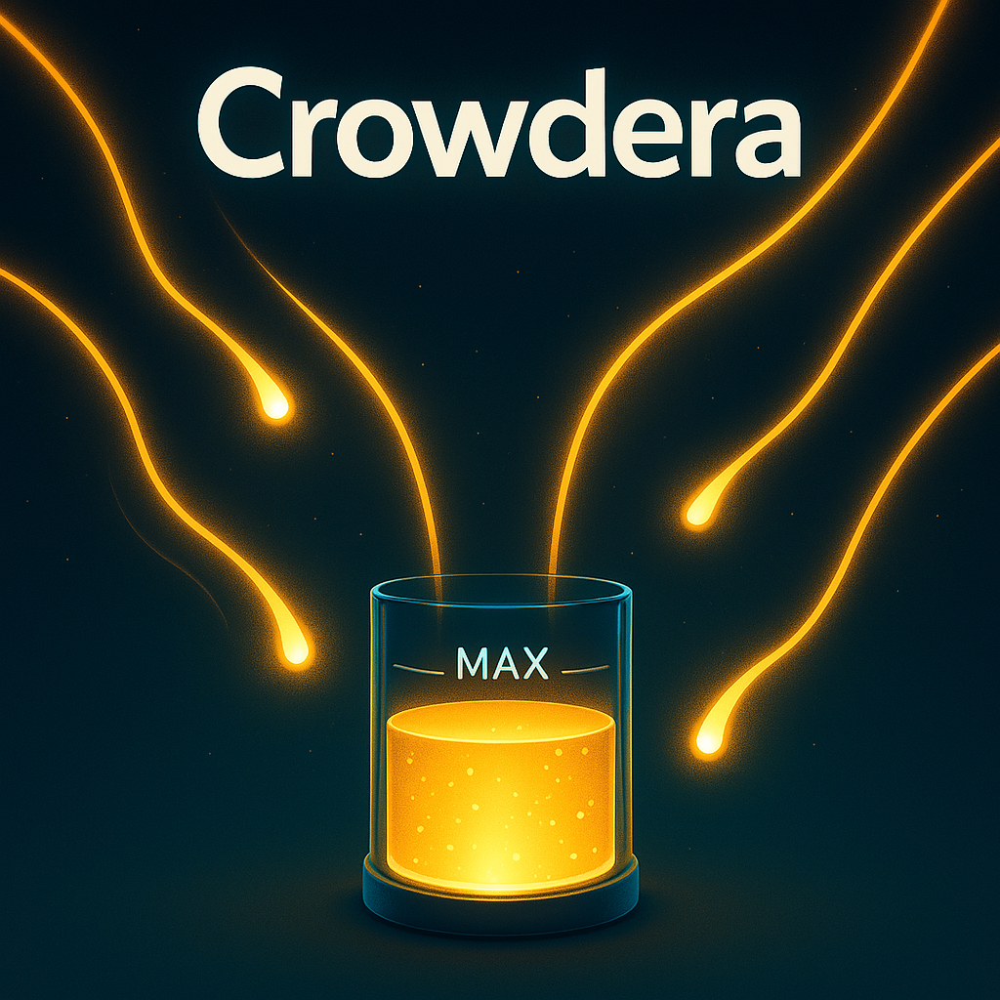

# Crowdera: ZK-Enhanced Event Funding Platform



> **A privacy-preserving donation platform that prevents over-funding of causes by using zero-knowledge proofs on Zircuit and rewards donors with commemorative NFT badges on Flow.**

## Table of Contents

- [Overview](#overview)
- [Integration](#integration)
- [Team](#team)
- [Setup & Testing](#setup--testing)
- [Experience & Feedback](#experience--feedback)
- [Demo](#demo)
- [Future Roadmap](#future-roadmap)
- [Repository Structure](#repository-structure)

## Overview

ZK-Enhanced Event Funding Platform addresses a critical issue in Thailand's donation landscape. We've all seen dramatic stories of people in need that flood social media feeds, generating overwhelming donation responses that often exceed actual needs. This can transform genuine assistance into problematic wealth accumulation for recipients.

Our platform enables transparent event and cause funding with privacy-preserving donations using zero-knowledge proofs. By setting clear funding goals and automatically enforcing donation caps, we ensure donations match actual needs without excess. The system provides real-time updates on campaign progress and stops accepting donations once goals are met, preventing the problem of over-donation while maintaining donor privacy.

## Integration

### Zircuit Integration

We integrated Zircuit's EIP-7702 (account abstraction) to implement zero-knowledge proofs for private donations:

- Used Zircuit for the primary smart contract deployment where campaign creation and donations occur
- Implemented ZK-secured donations that hide donor identities while proving donation validity
- Created smart contract logic that automatically stops accepting donations once a campaign's funding goal is reached
- Leveraged Zircuit's account abstraction for seamless wallet interactions, providing a smooth user experience while preserving privacy
- Integrated a refund mechanism for cases where funds need to be returned, maintaining the same privacy guarantees

Our ZK implementation uses a custom circuit design that verifies donation legitimacy without revealing donor identity. The donation flow works as follows:

1. User selects a campaign and donation amount
2. System generates a ZK proof that validates the donation without revealing the donor
3. Smart contract verifies the proof and accepts the donation
4. If the donation would exceed the campaign's goal, it automatically accepts only what's needed and refunds the rest

### Flow Integration

We utilized the Flow blockchain to create and distribute commemorative NFT badges to donors:

- Implemented a Flow smart contract that mints unique NFT badges for successful donations
- Created a secure bridge between Zircuit (for anonymous donations) and Flow (for NFT rewards)
- Designed a system that preserves donor privacy while still enabling them to receive their NFT badges
- Used Flow's efficient resource-oriented programming model to create a gas-efficient NFT minting process
- Implemented various badge designs that reflect different donation levels and campaigns

The Flow integration works as follows:

1. When a donation is successfully processed on Zircuit, a cryptographic proof is generated
2. The donor can use this proof to claim their NFT badge on Flow without revealing their identity
3. The badge serves as both a commemoration of their donation and proof of participation
4. Each badge contains metadata about the campaign but not the donor's identity or donation amount

## Team

| Name                 | Role                          | Background                                             | Social Handles                                                                    |
| -------------------- | ----------------------------- | ------------------------------------------------------ | --------------------------------------------------------------------------------- |
| Pawee Tantivasdakarn | Lead Smart Contract Developer | Blockchain developer with 3+ years ZK-proof experience | [GitHub](https://github.com/paweenthx) / [Twitter](https://twitter.com/paweenthx) |
| Chirayu Charoenyos   | Frontend Developer            | React/NextJS specialist, Computer Science student      | [GitHub](https://github.com/chiracyou) / [Twitter](https://twitter.com/chiracyou) |
| Thawinwit N.         | Backend Integration           | Golang developer with blockchain integration expertise | [GitHub](https://github.com/thawinwit) / [Twitter](https://twitter.com/thawinwit) |

## Setup & Testing

### Setup

```bash
# Clone the repository
git clone https://github.com/paweenthx/zk-event-funding.git
cd zk-event-funding

# Install dependencies
npm install

# Configure environment
cp .env.example .env
# Edit .env with your configuration settings
```

### Development

```bash
# Start the development server
npm run dev

# The app will be available at http://localhost:3000
```

### Deployment

```bash
# Build the project
npm run build

# Deploy the web application
npm run deploy
```

## Experience & Feedback

### Zircuit Experience

Working with Zircuit and implementing EIP-7702 for our ZK-secured donations was a rewarding experience:

**Wins:**

- The account abstraction features provided a seamless UX while maintaining privacy
- Documentation was clear on implementing basic ZK proofs
- The developer community was helpful when we encountered integration questions
- The ZK implementation allowed us to create a donation system that preserves donor privacy while maintaining public transparency about funding progress
- Smart contract implementation was flexible enough to support our funding cap feature

**Challenges:**

- Initial setup of the ZK verification circuit had a steeper learning curve than expected
- Testing ZK proofs thoroughly required building custom test utilities
- Some edge cases in ZK verification required additional error handling
- Implementing the partial donation acceptance/refund mechanism while maintaining ZK privacy required creative solutions

Overall, Zircuit provided a solid foundation for our privacy-preserving donation system and would be recommended for projects requiring strong privacy guarantees with good UX.

### Flow Experience

Integrating with Flow blockchain for NFT badges was straightforward and efficient:

**Wins:**

- Cadence's resource-oriented programming model made implementing NFT logic intuitive
- Flow's transaction model allowed for efficient batch minting of NFTs
- Low transaction fees made issuing badges to all donors economically viable
- Strong documentation and examples accelerated our development process
- The Flow community provided helpful support when we encountered integration challenges

**Challenges:**

- Bridging between Zircuit and Flow while maintaining privacy guarantees required careful design
- Implementing the cryptographic verification for anonymous badge claims took additional effort
- Ensuring a smooth cross-chain user experience required extensive testing

Flow proved to be an excellent choice for our NFT badge system due to its efficiency, low costs, and developer-friendly environment.

## Demo

Our demo showcases the complete user journey through the ZK-Enhanced Event Funding Platform:

1. **Campaign Creation**: Watch an organizer create a new funding campaign with a specific goal
2. **Anonymous Donations**: See how donors can contribute while maintaining privacy
3. **Funding Cap in Action**: Witness the system automatically handle a donation that would exceed the funding goal
4. **NFT Badge Minting**: Observe how donors receive their commemorative NFT badges on Flow without compromising their anonymity
5. **Badge Collection**: See the different badge designs and how they showcase participation without revealing identity
6. **Transparent Progress**: View real-time updates of campaign progress with complete anonymity for donors
7. **Fund Withdrawal**: See how organizers can withdraw funds once the goal is met

[](https://youtu.be/YOUR_VIDEO_ID)

_Click the image above to watch our demo video_

Our demo highlights the key innovations:

- ZK-proof verification for anonymous donations
- Automatic funding cap enforcement
- Cross-chain NFT badge rewards on Flow
- Privacy-preserving badge claiming mechanism
- Smooth user experience through Zircuit's account abstraction

## Future Roadmap

While our hackathon submission demonstrates the core functionality, we plan to expand the platform with the following features:

1. **Enhanced NFT Badges**: Implement tiered and evolving badges that change based on donation history
2. **Verification System**: Implement a KYC system for campaign organizers to increase trust while maintaining donor privacy
3. **Multi-Currency Support**: Accept donations in various tokens and stablecoins
4. **Campaign Categories**: Add categorization for different types of donation needs (medical, education, disaster relief)
5. **Mobile App**: Develop a dedicated mobile application for easier access
6. **Integration with Traditional Payment Methods**: Allow donations via credit cards and bank transfers with the same privacy guarantees
7. **Decentralized Governance**: Implement a community voting system for dispute resolution

## Repository Structure

```
zk-event-funding/
├── contracts/
│   ├── zircuit/                   # Zircuit smart contracts
│   │   ├── Campaign.sol           # Main campaign contract
│   │   ├── ZKDonation.sol         # ZK donation implementation
│   │   └── interfaces/            # Contract interfaces
│   └── flow/                      # Flow smart contracts
│       ├── DonationBadge.cdc      # NFT badge contract
│       └── BadgeClaiming.cdc      # Anonymous badge claiming
├── frontend/                      # Frontend application
│   ├── src/
│   │   ├── components/            # React components
│   │   ├── hooks/                 # Custom React hooks
│   │   ├── pages/                 # Page components
│   │   └── utils/                 # Utility functions
│   └── public/                    # Static assets
├── backend/                       # Backend services
│   ├── api/                       # API routes
│   └── services/
│       ├── zircuit.js             # Zircuit integration
│       └── flow.js                # Flow integration
├── docs/                          # Documentation
│   ├── zkp.md                     # ZK proof documentation
│   └── flow.md                    # Flow integration docs
└── README.md                      # This file
```

## License

This project is licensed under the MIT License - see the [LICENSE](LICENSE) file for details.
